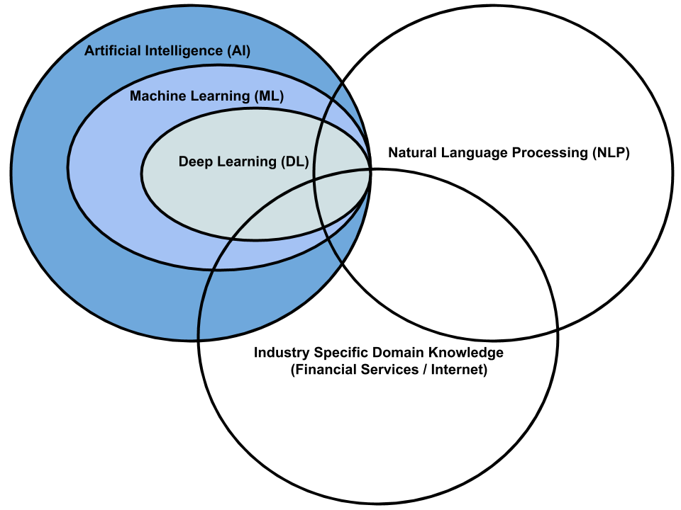

> **_🙏ॐ श्रीं ह्रीं सरस्वत्यै नमः॥ I meditate on Lordess Saraswati, the goddess of education, music and speech.🙏_**

I am a **Senior Analyst - Data Science** at the **Artificial Intelligence, Centre of Excellence of** [Fidelity Investments](https://www.fidelity.com/){:target="_blank"}. My research interests include **Industrial Applications of Machine Learning and Deep Learning based Natural Language Processing**. 

Over the last few years, I have been empowering business to take **data driven decisions** and **improving the digital experience** of millions of users across different industries like **Financial Services, Internet** and so on. In addition to being co-author of the books [Natural Language Processing Fundamentals](https://www.packtpub.com/in/big-data-and-business-intelligence/natural-language-processing-fundamentals){:target="_blank"} and [The Natural Language Processing Workshop](https://www.packtpub.com/in/data/the-natural-language-processing-workshop-second-edition){:target="_blank"}, I have several [publications](https://scholar.google.com/citations?user=7Jm4_McAAAAJ&hl=en){:target="_blank"} in proceedings of **international conferences** and **refereed journals**.

I hold a **Master's Degree** in **Software Systems (with specialization in Data Analytics)** from [BITS Pilani, India](http://www.bits-pilani.ac.in/){:target="_blank"} and a **Bachelor's Degree** in **Computer Science and Engineering**.  

Outside work, I like to [play harmonica](https://www.youtube.com/watch?v=ajFlw7rnfkI&list=PLWVXvBh2xmj_yWcdldvo6w1LD1C-d4xSw){:target="_blank"}. Being an [adventure lover](https://www.youtube.com/watch?v=hPyn1LKRLCo&list=PLWVXvBh2xmj-XlHYzumNLZazfpmim4klq){:target="_blank"} and a fitness buff, I believe that **"Health is Wealth"**.

In one sentence, **"I am a Data Scientist by profession, an Athlete by choice and an Artist from within".** 😊

  
Selected Updates 👇

  <ul>
    <li> Oct 2020: Our research work on retrieving the most related question for a given search query has been accepted as a full paper in <a href="http://mlnlp.net/"  target="_blank">MLNLP'20, China</a> (Workshop of ACM Conference ACAI'20)</li>
    <li> Sep 2020: Completed <a href="https://www.coursera.org/account/accomplishments/specialization/certificate/LA8H4KG9HWJP" target="_blank">Natural Language Processing Specialization</a> offered by deeplearning.ai (Coursera)</li>
    <li> Sep 2020: Completed certification on <a href="https://www.coursera.org/account/accomplishments/certificate/4R95DUBLTFUD" target="_blank"> Natural Language Processing with Attention Models</a> (Coursera)</li>
    <li> Sep 2020: Completed certification on <a href="https://www.coursera.org/account/accomplishments/certificate/WJ4JANLL23FY" target="_blank">Natural Language Processing with Sequence Models</a> (Coursera)</li>
    <li> Sep 2020: Completed certification on <a href="https://www.coursera.org/account/accomplishments/certificate/D5VQ5Q8QH2CS" target="_blank">Natural Language Processing with Probabilistic Models</a> (Coursera)</li>
    <li> Aug 2020: Attended <a href="https://www.kdd.org/kdd2020/" target="_blank">KDD 2020</a></li>
    <li> Aug 2020: Completed certification on <a href="https://www.coursera.org/account/accomplishments/certificate/MEGC5CUXA5JX" target="_blank"> Natural Language Processing with Classification and Vector Spaces</a> (Coursera)</li>
    <li> Aug 2020: Book titled, <a href="https://www.packtpub.com/in/data/the-natural-language-processing-workshop-second-edition" target="_blank">The Natural Language Processing Workshop</a> got published by Packt Publishing</li>
    <li> Jul 2020: Received "Excellence In Action (Team) Award" from Fidelity Investments</li>
    <li> Jun 2020: Participated in Fidelity HealthifyMe Challenge 2020. Maintained streak for 42 days. Ranked 56 (All India). 
    <li> May 2020: Authored and released a set of poems in Bengali on <a href="https://www.youtube.com/playlist?list=PLWVXvBh2xmj_CVGr_XFmvcX69LzdsxVNe" target="_blank">YouTube</a>
    <li> May 2020: Played <a href="https://youtu.be/ajFlw7rnfkI"  target="_blank">Harmonica </a> at the launch event of PI Fun Friday (Fidelity Investments)</li>
    <li> May 2020: Received "You've Earned It Team (India) Award" from Fidelity Investments</li>
    <li> May 2020: Paper titled, <a href="https://doi.org/10.1007/s41870-020-00473-1" target="_blank">Identifying click baits using various machine learning and deep learning techniques</a> got published in International Journal of Information Technology, Springer</li>
    <li> Feb 2020: Visited Hampi (UNESCO World Heritage Site) along with my family
    <li> Jan 2020: Collaborated with team Symphony and played <a href="https://www.youtube.com/watch?v=6pQG9bb1QaM" target="_blank"> Harmonica </a> at the BA&R (Fidelity Investments) team's offsite</li>
  
  
